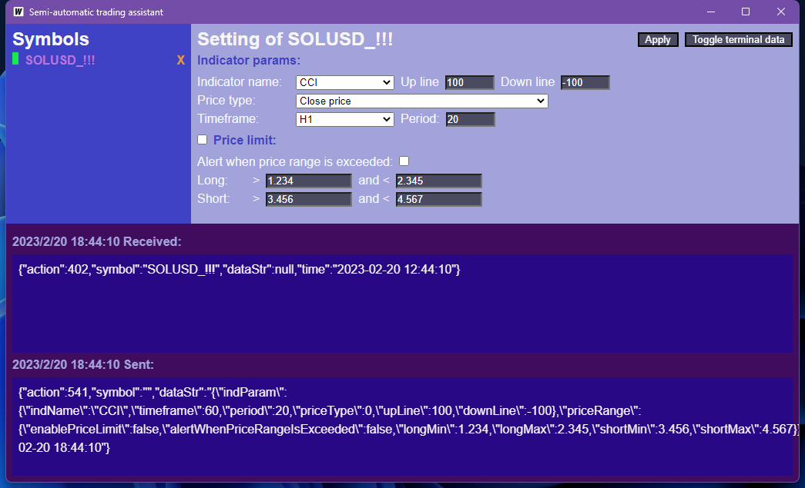

# MT-SATA-server

## About

Semi-automatic trading assistant server for metatrader.



### Technology stack

* backend:
  * golang: programming language
  * wails: A project that enables you to write desktop apps using Go and web.technologies.
* frontend:
  * typeScript: programming language
  * vuejs: A progressive JavaScript framework.
* communication:
  * use socket with metatrader
  * use web socket with frontend

## Develop

You can configure the project by editing `wails.json`. More information about the project settings can be found
here: https://wails.io/docs/reference/project-config

To run in live development mode, run `wails dev` in the project directory. This will run a Vite development
server that will provide very fast hot reload of your frontend changes. If you want to develop in a browser
and have access to your Go methods, there is also a dev server that runs on http://localhost:34115. Connect
to this in your browser, and you can call your Go code from devtools.

If you want to modify the golang code multiple times in a short time, it's better to stop running the command `wails dev`.

## Building

To build a redistributable, production mode package, use `wails build`.

## trouble shutting

### websocket Error "connection to 'ws://localhost:12345/' failed: Invalid frame header"
Refer: https://qiita.com/dbgso/items/4bbfa52d99cae6c547a4, create: `vue.config.js`, add the following content:

```js
export const devServer = {
    proxy: {
        '/': {
            target: 'http://localhost:12345',
            ws: true,
            changeOrigin: true
        }
    }
};
```